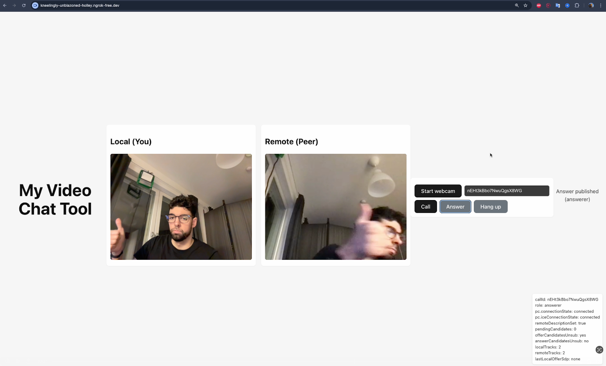

# my-video-chat

A small demo video chat application that uses browser WebRTC for peer-to-peer media streaming and Firebase (Firestore) as a lightweight signaling channel.

This repository contains a Vite-based frontend, minimal Cloud Functions stub, and Firebase configuration intended for local development and small-scale testing.

## Features
- Peer-to-peer audio/video using RTCPeerConnection and browser WebRTC APIs
- Firestore used as the signaling channel (offers/answers and ICE candidates)
- Minimal, framework-light frontend (Vite + plain React entry) for experimentation

## Quick start (development)

1. Install and run the frontend

```bash
cd my-video-chat-tool
npm install
npm run dev
```

Open the local dev URL printed by Vite to access the UI.

2. (Optional) Install and run Cloud Functions or emulators

```bash
cd functions
npm install
# Use Firebase CLI / emulators if you want to test functions locally
```

3. Configure Firebase

- Create or select a Firebase project and update the Firebase config used by the frontend if necessary.
- Firestore is used for signaling: offers/answers are written to documents and ICE candidates are stored in subcollections.

Note: the repository contains `firebase.json`, `firestore.rules`, and `storage.rules` for deployment — review and tighten rules before production use.

## Project layout

- `my-video-chat-tool/` — Frontend app (Vite). Key files:
	- `src/main.jsx` — WebRTC and signaling logic (peer connection, media setup, Firestore signaling).
	- `index.html` — Minimal UI and controls.
	- `package.json` — Frontend dependencies and scripts.
- `functions/` — Cloud Functions stub and package manifest (if used).
- `firebase.json` — Firebase hosting and emulator configuration.
- `firestore.rules`, `storage.rules` — Security rules for Firestore and Storage.

## How it works (high level)

- The client captures local media (camera/mic) and attaches tracks to an RTCPeerConnection.
- To start a call, the caller creates an SDP offer and writes it to a Firestore document. The callee reads that document, sets the remote description, creates an answer, and writes it back.
- ICE candidates are exchanged through Firestore subcollections to complete the connectivity checks.

UI flow (typical)
- Start webcam to capture local media.
- Click "Call" to generate an offer and create a Call ID.
- Share the Call ID with your peer. The peer pastes it into their UI and clicks "Answer" to join the call.

## Limitations and notes
- Firestore as a signaling channel is convenient for demos but not optimized for production-scale signaling; use a dedicated signaling server for larger deployments.
- The provided Firestore rules may be permissive for development. Secure them appropriately before deploying.
- Hang-up, reconnection and complex multi-party flows are not fully implemented in this demo.

## Deployment

1. Build the frontend

```bash
cd my-video-chat-tool
npm run build
```

2. Deploy to Firebase Hosting (after configuring your Firebase project)

```bash
# from the repository root
firebase deploy
```

3. Configure and run ngrok (if not want to deploy app)

```bash
cd /Users/borjajavierre/my-video-chat/app/my-video-chat-tool 
npm install
npm run dev -- --host 0.0.0.0 --port 5174
curl -v http://localhost:5173/ 
```

and eventually run 

```
ngrok http 5173

```

The local peer can connect using ```http://localhost:5174``` and the remote peer using ```https://kneelingly-unblazoned-holley.ngrok-free.dev``` (onece ngrok is correctly initialized)

This is how it should look like from the sender side:



Confirm the `hosting.public` path in `firebase.json` matches the frontend build output (usually `dist`).

You can find a demo of a call here too:

[![Demo]](./2p-call-demo.mp4)

## Contributing
Bug reports, improvements and PRs are welcome. Keep changes small and focused.

## License
This project includes a `LICENSE` file in the repository root — refer to it for licensing terms.
